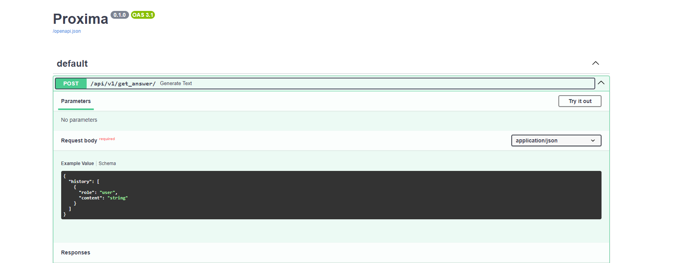
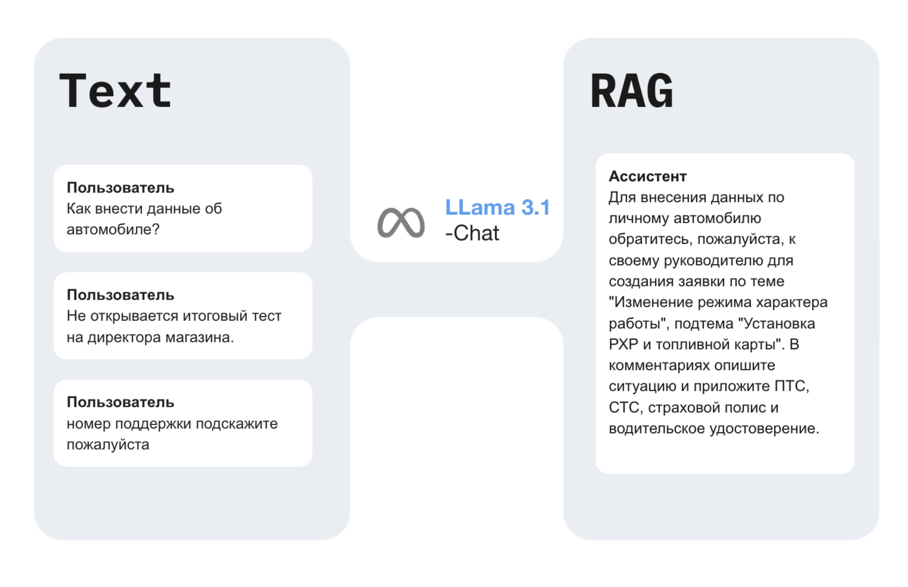

# 🤖💬 AI Assistant (Команда Proxima)

AI Assistant для автоматизации отдела поддержки клиентов компании X5. Этот ассистент способен обрабатывать запросы пользователей, автоматически предоставлять ответы на часто задаваемые вопросы, помогать в решении типичных проблем и перенаправлять сложные запросы живым операторам. Проект направлен на повышение эффективности работы службы поддержки, снижение нагрузки на операторов и улучшение клиентского опыта.

### Deployed Demo API:
http://176.114.66.132:8000/docs



## Pipeline


## How To Use
### 1. Clone repo to server
```
foo@bar:~$ git clone https://github.com/proxima-ai-hub/ai-assistant.git
```

### 2. Install dependencies
```
foo@bar:~$ 
```

### 3. ...
```
foo@bar:~$ 
```

### 4. ...
```
foo@bar:~$ 
```
### N. Run application from root folder backend
```
foo@bar:~$ 
```


## Участники команды Proxima и их роли

### 1. **Евгений** - Капитан команды, Fullstack разработчик
- **Ответственности**:
  - Руководил командой на протяжении всего хакатона.
  - Разработал общую архитектуру проекта.
  - Учавствовал во фронтенд разработке, помогал по логике и структуре.
  - Подготовил и представил презентацию (pitch deck) для финальной демонстрации.
  - Настроил инфраструктуру проекта, обеспечил техническое поддержку и сопровождение.

### 2. **Алена** - Фронтенд разработчик
- **Ответственности**:
  - Разработала и реализовала пользовательский интерфейс (UI) приложения.
  - Сконцентрировалась на пользовательском опыте и адаптивности интерфейса.
  - Тесно сотрудничала с Евгением для обеспечения бесперебойной работы фронтенда.
  - Интегрировала UI с API, предоставленными командой DevOps.

### 3. **Ричард** - Backend/MLOps инженер
- **Ответственности**:
  - Настроил и конфигурировал инфраструктуру бэкенда.
  - Разработал и поддерживал API для взаимодействия между фронтендом и моделью.
  - Реализовал Dev/ML-Ops процессы для автоматизации разработки и развёртывания.
  - Настраивал и запускал API на удаленном сервере, обеспечивая его интеграцию с моделью.
  - Разрабатывал архитектуру проекта. (ML Engineers разрабатывали архитектуру модели)

### 4. **Семён** - ML Engineer
- **Выполненные задачи**:
  - Придумал и имплементировал пайплайн предобработки и очистки данных.
  - Занимался разбиением категорий на кластеры.
  - Провел эксперимент с fine-tune модели gemma-2-9b-it.
  - Помогал в развертывании приложения на удаленном сервере.
  - Участвовал в тестировании системы.

### 5. **Егор** - ML Engineer
- **Выполненные задачи**:
  - Придумал и имплементировал архитектуру LLM-агента на основе LangGraph.
  - Разработал интерфейсы для создания, заполнения и обращения к векторной базе данных qdrant.
  - Разработал бенчмарк для оценки качества решения, занимался сбором метрик.
  - Проводил эксперименты с разными моделями, энкодерами, параметрами LLM с последующей оценкой качества.
  - Занимался оптимизацией архитектуры, написанием и тюнингом промптов.
  - Помогал в развертывании приложения на удаленном сервере.

## Технологический стек
- **Фронтенд**: AngularJS
- **Бекенд**: FastAPI, LLAMA 3.1:8B, Qdrant, Redis (бенчмаркинг), LangGraph, SentenceTransformer encoders
-​⬤

# Proxima AI Assistant Technical Specs

## Branching Naming Conventions

We follow a trunk-based development approach to keep our workflow streamlined and efficient. Below are the guidelines for creating branches for various purposes:

### Main Branch
- **`main`**: The trunk branch where all changes are integrated. It should always be in a deployable state.

### Short-Lived Branches
All work is done on short-lived branches that are frequently merged back into `main`. These branches should be kept simple and focused, often representing a single task or bug fix.

### Feature Branches
Feature branches are used for developing new features. Since we follow a trunk-based approach, these branches should be short-lived, with frequent merges back into `main`.

- **Branch Name Format**: `feature/{short-description}`
- **Examples**:
  - `feature/user-authentication`
  - `feature/dashboard-ui`
  
- **Guidelines**:
  - Create a feature branch directly off `main`.
  - Frequently merge your feature branch back into `main` to minimize divergence.
  - Keep the branch life short—merge back as soon as the feature is ready.

### Bug Fix Branches
Bug fix branches are used for addressing specific issues or bugs. Like feature branches, these should also be short-lived.

- **Branch Name Format**: `bugfix/{issue-id}-{short-description}`
- **Examples**:
  - `bugfix/123-login-error`
  - `bugfix/456-api-timeout`
  
- **Guidelines**:
  - Create a bug fix branch directly off `main`.
  - Merge back into `main` as soon as the bug is fixed.

### Hotfix Branches
Hotfix branches are used for urgent fixes that need to be deployed immediately, usually to resolve issues in production.

- **Branch Name Format**: `hotfix/{short-description}`
- **Examples**:
  - `hotfix/critical-security-patch`
  - `hotfix/fix-crashing-bug`
  
- **Guidelines**:
  - Create a hotfix branch directly off `main`.
  - Merge back into `main` as soon as the fix is verified and ready for deployment.

### Experimental Branches (Optional)
If there’s a need to test out a new idea or experiment, create an experimental branch. These branches should still be short-lived and regularly synced with `main`.

- **Branch Name Format**: `experiment/{short-description}`
- **Examples**:
  - `experiment/new-algorithm`
  - `experiment/ui-concept`
  
- **Guidelines**:
  - Create an experimental branch off `main`.
  - Merge back into `main` if the experiment is successful.

### Workflow
1. Create a new branch off `main` for any new feature, bug fix, or hotfix.
2. Make your changes in the branch.
3. Push the branch to the remote repository.
4. Frequently merge changes from `main` into your branch to stay up-to-date.
5. Create a pull request (PR) to merge the branch back into `main`.
6. Once the PR is approved and merged, the branch can be deleted.

By adhering to this trunk-based branching strategy, we ensure continuous integration and a consistent, deployable codebase at all times.
